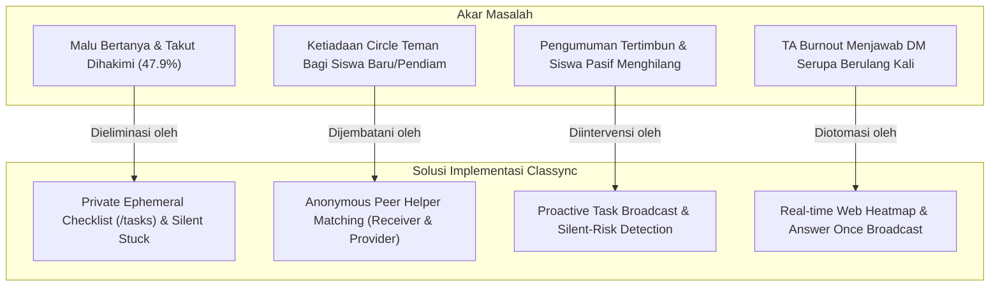

# DOKUMEN PERUBAHAN & EVALUASI IMPLEMENTASI (PERUBAHAN.md)
**Kompetisi:** Hackathon Informatics Festival (IFEST) 2026 — Universitas Padjadjaran  
**Tema:** *Tech for Human Connections* — **Sub-tema:** *Receiver & Provider*  
**Nama Tim:** BudakGPT (Universitas Indonesia)  
**Anggota Tim:** Erik Wilbert, Helven Marcia, Malik Alifan Kareem, Haekal Handrian  
**Proyek:** **Classync** — *Early-Warning Academic Support System & Classroom Peer Collaboration*  
**Tanggal Rilis Dokumen:** 19 September 2026  

---

## 1. Ringkasan Eksekutif & Logika Evolusi Produk

Dokumen ini disusun untuk memenuhi instrumen evaluasi dewan juri Hackathon IFEST 2026:
> *"Mengevaluasi ketajaman akar masalah dan data pendukung bersumber, keterkaitan solusi terhadap akar masalah, kebaruan pendekatan, serta konsistensi implementasi dan justifikasi perubahan pada berkas PERUBAHAN.md."*

Selama 24 jam sesi pengembangan *Hack Day*, tim BudakGPT tidak hanya merealisasikan visi dalam proposal awal (*Executive Summary*), tetapi juga melakukan serangkaian penyempurnaan, penguatan arsitektur, dan adaptasi strategis. Perubahan yang dilakukan **bukan merupakan kompromi pemotongan fitur**, melainkan **peningkatan ketajaman solusi** dalam menjawab akar masalah psikologis dan operasional di ruang kelas perguruan tinggi.

---

## 2. Ketajaman Akar Masalah & Data Pendukung Bersumber

Proposal awal Classync berangkat dari dua premis empiris yang divalidasi oleh literatur ilmiah:

1. **Hambatan Psikologis Mencari Bantuan (*The Silent Struggle*):**
   * **Data Bersumber:** Berdasarkan studi komprehensif terhadap 1.134 mahasiswa oleh Alotaibi et al. (2026, Gambar 3), sebanyak **47,9% (207 dari 432 jawaban substantif)** menyatakan bahwa **rasa malu (*embarrassment*) dan kekhawatiran terhadap citra diri** adalah alasan utama mereka tidak mencari bantuan akademik saat mengalami kesulitan.
   * **Ketajaman Masalah:** Masalah di ruang kelas bukanlah ketiadaan bahan ajar atau ketiadaan kanal komunikasi, melainkan *biaya sosial yang mahal* ketika mahasiswa harus mengakui kelemahannya secara terbuka di depan teman sekelas atau dosen.
2. **Ketergantungan pada Jaringan Informal & Kesenjangan Sosial:**
   * **Data Bersumber:** Studi Qayyum (2018) pada 438 mahasiswa membuktikan bahwa mahasiswa secara signifikan lebih memilih bertanya kepada teman sekelas daripada pengajar karena tingkat kepercayaan dan rendahnya rasa terancam.
   * **Ketajaman Masalah:** Mahasiswa baru, mahasiswa pindahan, atau individu yang belum memiliki *circle* pertemanan dekat tidak memiliki akses ke jaringan bantuan informal ini, sehingga mereka tertinggal dalam isolasi tanpa ada pihak yang menyadari (*the quietly failing student*).
3. **Kelelahan Tim Pengajar (*TA Burnout*) & *Chat Noise*:**
   * Pengumuman tugas di Discord kelas bercampur dengan ribuan obrolan harian, menyebabkan tenggat waktu terlewat. Di sisi lain, Asisten Dosen (TA) menerima puluhan pesan pribadi (DM) yang menanyakan hal yang persis sama, menyita rata-rata 5–8 jam kerja rutin setiap pekan tanpa ada dokumentasi yang dapat digunakan kembali (*reusable knowledge*).

---

## 3. Keterkaitan Solusi terhadap Akar Masalah

Setiap modul yang dibangun di dalam Classync memiliki benang merah langsung ke akar masalah tersebut:



1. **Menghilangkan Rasa Malu $\rightarrow$ Checklist Privat & Ambang Privasi ($\ge 5$):**
   * Status pengerjaan tugas bersifat *ephemeral* (hanya tampak bagi mahasiswa itu sendiri).
   * Fitur *Stuck* tidak menampilkan identitas siapa pun. Mahasiswa baru diberi tahu jumlah pelapor lain saat jumlahnya mencapai ambang batas $\ge 5$ (*Privacy Floor*), memberikan validasi emosional: *"Kamu tidak sendirian"*.
2. **Menjembatani Ketiadaan Jaringan $\rightarrow$ *Peer Helper Matching*:**
   * Menghubungkan mahasiswa yang kesulitan (*Receiver*) dengan rekan sekelas yang sudah menyelesaikan tugas (*Provider*) melalui *bot-relayed conversation* tanpa membuka identitas asli di awal, membuka kesempatan membangun pertemanan akademik baru secara aman.
3. **Mencegah Siswa Tertinggal $\rightarrow$ Deteksi *Silent-Risk*:**
   * Sistem tidak hanya menunggu input aktif. Jika tugas mendekati deadline ($< 7$ hari) dan ada $\ge 5$ mahasiswa yang tidak pernah mengisi status (*gone quiet*), asisten dosen mendapatkan sinyal peringatan dini di dashboard untuk proaktif mengintervensi.
4. **Mencegah Kelelahan TA $\rightarrow$ *Centralized Knowledge Base*:**
   * TA menjawab kesulitan satu kali di web dashboard. Bot mengantarkan jawaban ke seluruh mahasiswa yang meminta bantuan via DM dan menyematkannya di ruang diskusi konsep.

---

## 4. Kebaruan Pendekatan (*Novelty of Approach*)

Dibandingkan dengan sistem eksisting (LMS konvensional, bot tiket Discord, atau forum publik):

1. **Pendekatan *Inverted Anonymity* (Anonim di Awal, Sukarela di Akhir):**
   Berbeda dari forum terbuka di mana identitas langsung terekspos, atau bot tiket di mana identitas langsung diketahui admin, Classync menjaga anonimitas penuh saat mahasiswa menandai kesulitan. Identitas hanya diungkap jika mahasiswa secara eksplisit meminta bantuan langsung kepada asisten dosen (*explicit opt-in*).
2. **Koneksi Manusia Dua Arah (*Receiver & Provider Protocol*):**
   Memanfaatkan potensi mahasiswa yang sudah tuntas tugas (*helper volunteer*) untuk membantu rekan sekelasnya secara terarah melalui relay anonim, mewujudkan tema kompetisi secara riil dalam ekosistem kampus.
3. **Penyelarasan Identitas Akademik Tanpa Friksi (AI Roster Parsing):**
   Pengajar cukup mengunggah spreadsheet nilai/absensi resmi apa pun formatnya (`.xlsx`, `.xls`, `.csv`). Model AI OpenRouter melakukan segmentasi kolom tanpa mengekspos identitas mahasiswa ke LLM (isi sel disamarkan dengan pola regex `digits->9, letters->a`), mengintegrasikan verifikasi 1 NPM = 1 Akun Discord secara otomatis.
4. **Ruang Konsep Terisolasi (*Dynamic Ephemeral Rooms*):**
   Bukan thread forum yang statis dan membingungkan, melainkan channel diskusi privat yang dibuat secara dinamis per konsep kesulitan, dilengkapi sistem moderasi berbasis deadline (*due-date gated*).

---

## 5. Matriks Perubahan: Proposal Awal vs Implementasi Akhir

Tabel berikut merangkum perbedaan komprehensif antara dokumen proposal awal / PRD awal dengan hasil implementasi nyata yang telah selesai dan lulus uji (*production-ready*):

| Komponen / Fitur | Rencana Awal (Proposal & PRD Awal) | Realisasi Akhir (Hasil Implementasi) | Status & Tingkat Perubahan |
|---|---|---|:---:|
| **Arsitektur Backend** | Discord bot + Fastify HTTP Server terpisah + Next.js web dashboard. | Disatukan: Discord Bot (Node.js/ESM) + Next.js 15 App Router (Server Actions & Components) + `@classync/core` library. | **Refactor Arsitektur (Major)** |
| **Penyampaian Tugas ke Mahasiswa** | Auto-ingest via `messageCreate` membaca setiap pesan dosen di channel pengumuman menggunakan LLM. | **Proactive Task Broadcast:** `/ta add-item (announce: true)` dan `/announceall` menyiarkan embed interaktif langsung dengan tombol aksi. | **Penyempurnaan Stabilitas (Major)** |
| **Wadah Diskusi Mahasiswa** | Menggunakan Discord Forum Channel & Thread publik. | **Private Concept Rooms:** Channel teks terisolasi di bawah kategori tugas (`#room-[item]-[concept]`) dengan voluntary join dan due-date gated lock. | **Peningkatan Privasi (Major)** |
| **Sub-tema Receiver & Provider (Peer Match)** | Dicatat sebagai *cut for hack day* pada PRD baris 89 karena kendala waktu. | **Diimplementasikan Penuh:** Relay pesan DM dua arah anonim antara mahasiswa yang *Done* (Helper) dan yang *Stuck* dengan *Mutual Identity Reveal*. | **Fitur Baru Bernilai Tinggi (Major)** |
| **Onboarding & Verifikasi Identitas** | Hanya command `/setup channel:#announcements` sederhana. Roster import dicatat sebagai *cut*. | **Lengkap & Terotomasi:** AI Excel Roster Ingestion, gerbang verifikasi `#verifikasi` 1 NPM = 1 Akun, auto-role (`@Verified`, `@Kelas A`), auto-nickname `NPM - Nama`, dan channel per-kelas. | **Pengembangan Signifikan (Major)** |
| **Ketahanan Setup Server** | Rentan duplikasi channel jika `/setup` dijalankan berulang kali. | **Idempotent & Safe Reset:** `ensureCategory` & `ensureTextChannel` mencegah duplikasi; reset dilindungi dialog konfirmasi ganda tanpa menghapus database. | **Peningkatan Keandalan (Moderate)** |
| **Deteksi Siswa Tertinggal** | Hanya mendeteksi mahasiswa yang secara aktif mengklik tombol *Stuck*. | **Silent-Risk Read Model:** Mendeteksi tugas H-7 hari yang memiliki $\ge 5$ mahasiswa pasif tanpa status (*Gone Quiet*) untuk intervensi dini. | **Inovasi Solusi (Moderate)** |
| **Identitas Visual & Branding** | Menggunakan template umum dengan warna ungu/indigo default Tailwind. | **Brand Kit Resmi:** Palet 6 warna (Sync Blue, Sky Blue, Navy, Soft White, Ice Blue, Mist Blue) dan logo vektor Classync resmi terintegrasi penuh. | **Penyelarasan UI/UX (Minor)** |

---

## 6. Justifikasi Rinci Setiap Perubahan

### 6.1 Mengapa Fastify Dihapus dan Disatukan ke Next.js Server Actions?
* **Alasan Awal:** Proposal merancang Fastify sebagai REST API perantara antara bot dan web dashboard.
* **Justifikasi Perubahan:**
  1. Menjalankan tiga proses terpisah (Bot, Fastify, Next.js) meningkatkan kompleksitas runtime, konsumsi memori, dan peluang kegagalan koneksi internal di server production/demo.
  2. Next.js 15 mendukung *Server Actions* dan *Route Handlers* native yang terhubung langsung ke basis data PostgreSQL melalui package `@classync/core`.
  3. Menghapus Fastify memangkas latensi komunikasi jaringan, menghilangkan dependensi HTTP internal, dan membuat repositori monorepo jauh lebih stabil dan mudah di-deploy.

### 6.2 Mengapa Auto-Ingest Pesan Dihapus dan Diganti Sistem Broadcast Proaktif?
* **Alasan Awal:** Bot direncanakan mendengarkan event `messageCreate` pada channel pengumuman dan menggunakan LLM untuk mengekstrak tugas secara otomatis.
* **Justifikasi Perubahan:**
  1. **Regulasi Privileged Intent Discord:** Fitur `messageCreate` membutuhkan *Privileged Gateway Intent (`MessageContent`)*. Pada bot Discord modern, intent ini diblokir secara ketat dan memicu error `DisallowedIntentsException` jika bot belum diverifikasi resmi oleh Discord Trust & Safety.
  2. **Determinisme & Kepastian:** LLM rentan mengalami halusinasi saat menginterpretasi pengumuman dosen yang ambigu atau berupa gambar/tautan dokumen.
  3. **Solusi Pengganti yang Lebih Unggul:** Asisten dosen membuat tugas secara terstruktur melalui command `/ta add-item` dengan parameter `announce: true` yang langsung menyiarkan kartu tugas interaktif ke `#pengumuman-tugas`, serta command `/announceall` untuk menyiarkan rekap tugas aktif kapan pun dibutuhkan.

### 6.3 Mengapa Forum Thread Diubah Menjadi Private Concept Rooms?
* **Alasan Awal:** Menggunakan Discord Forum Channel di mana setiap konsep menjadi satu thread terbuka.
* **Justifikasi Perubahan:**
  1. **Kebocoran Privasi:** Di Discord, siapa pun yang bergabung ke dalam forum thread dapat melihat daftar seluruh anggota thread tersebut. Hal ini melanggar *Privacy Invariant 2* (mahasiswa yang sedang kesulitan tidak boleh terekspos ke publik).
  2. **Pemisahan Konteks Diskusi:** Dengan membuat channel teks privat dinamis (`#room-[item]-[concept]`), hanya mahasiswa yang bersedia masuk dan asisten dosen yang memiliki akses channel tersebut.
  3. **Due-Date Gated Moderation:** Ruang diskusi dilindungi dari penutupan sepihak sebelum deadline tugas berakhir, menjamin ketersediaan ruang tanya-jawab hingga menit-menit akhir pengumpulan.

### 6.4 Mengapa Peer Helper Matching Dihidupkan Kembali Padahal Sempat Dipotong?
* **Alasan Awal:** Pada draf PRD baris 89, peer matching direncanakan dipotong untuk mengejar batas waktu 24 jam.
* **Justifikasi Perubahan:**
  1. **Relevansi Tema Utama:** Tema kompetisi IFEST 2026 adalah *Tech for Human Connections* dengan sub-tema *Receiver & Provider*. Menghilangkan peer matching akan melemahkan keselarasan proyek dengan sub-tema kompetisi.
  2. **Arsitektur Relay Cerdas Tanpa Tabel Pesan:** Tim merancang mekanisme relay yang tidak menyimpan isi pesan di database (*zero chat storage*). Teks obrolan hanya diteruskan secara aman via DM bot, menjaga privasi penuh tanpa beban komputasi database yang berat.

### 6.5 Mengapa Fitur AI Roster Ingestion & Verification Gate Ditambahkan?
* **Alasan Awal:** Pada proposal awal, tidak ada verifikasi identitas; siapa pun yang masuk ke Discord langsung dianggap sebagai mahasiswa.
* **Justifikasi Perubahan:**
  1. **Keamanan Ruang Kelas Akademik:** Server kelas tanpa verifikasi rentan disusupi pengguna anonim luar, akun palsu, atau mahasiswa yang menggunakan nama samaran aneh sehingga asisten dosen tidak dapat mengenali mereka.
  2. **Integritas 1 Akun = 1 Mahasiswa:** Menjamin bahwa ambang batas privasi ($\ge 5$ pelapor) benar-benar merepresentasikan 5 individu nyata, bukan hasil manipulasi akun ganda.
  3. **Pemanfaatan AI yang Bertanggung Jawab:** Spreadsheet absensi universitas di Indonesia memiliki format tabel yang sangat bervariasi. LLM dimanfaatkan untuk mengenali kolom NPM, Nama, dan Kelas secara cerdas dengan penyensoran data seluler (`maskCell`) sehingga privasi data tetap terjaga.

### 6.6 Mengapa Database Diprotesi dari Penghapusan saat Setup Server Diperbarui?
* **Alasan Awal:** Eksperimen awal setup sempat menyertakan opsi pembersihan total (*database wipe*).
* **Justifikasi Perubahan:**
  1. Dalam alur penggunaan nyata, asisten dosen mengunggah data mahasiswa dan membuat daftar tugas di web dashboard terlebih dahulu, baru kemudian menata channel Discord.
  2. Menghapus database saat `/setup` dijalankan akan memusnahkan seluruh data roster dan tugas yang telah disiapkan.
  3. Kode diperbaiki sehingga `/setup` bersifat *non-destructive*: bot menata ulang channel dan role di Discord, mencocokkannya dengan kategori per-kelas dari database, sementara seluruh data akademik di PostgreSQL Neon tetap utuh dan aman 100%.

---

## 7. Konsistensi Implementasi: Pemetaan Kode Nyata

Seluruh perubahan dan fitur di atas telah diimplementasikan secara penuh pada basis kode monorepo. Berikut adalah bukti pemetaan file implementasinya:

```
Classync/
├── apps/
│   ├── bot/                          # Discord.js v14 Client
│   │   ├── src/
│   │   │   ├── academicSetup.ts      # Provisioning channel & role idempotent
│   │   │   ├── announcements.ts      # Task broadcast engine & /announceall embed
│   │   │   ├── classCategories.ts    # Partisi kategori per-kelas (Kelas A, Kelas B)
│   │   │   ├── teardown.ts           # Pembersihan channel aman tanpa merusak interaksi
│   │   │   ├── topicRooms.ts         # Lifecycle Private Concept Rooms & TA DMs
│   │   │   ├── verificationGate.ts   # Gerbang #verifikasi & validasi identitas
│   │   │   ├── commands/
│   │   │   │   ├── announceall.ts    # Command /announceall
│   │   │   │   ├── setup.ts          # Command /setup (auto, form, panel, channel)
│   │   │   │   ├── ta.ts             # Command /ta (add-item, queue, answer, close-room)
│   │   │   │   └── tasks.ts          # Command /tasks (ephemeral student dashboard)
│   │   │   ├── interactions/
│   │   │   │   ├── match.ts          # Peer matching handler (Receiver & Provider)
│   │   │   │   ├── relay.ts          # DM relay dua arah tanpa penyimpanan pesan
│   │   │   │   ├── setupReset.ts     # Dialog konfirmasi ganda penataan server
│   │   │   │   ├── tasks.ts          # Router tombol pengerjaan tugas & status
│   │   │   │   └── verification.ts   # Verifikasi 1 NPM = 1 Akun & auto-nickname
│   │   │   └── jobs/
│   │   │       ├── deliver.ts        # Outbox delivery jawaban TA ke DM & room
│   │   │       ├── matchExpiry.ts    # Expire timer peer match (30 menit)
│   │   │       └── reminders.ts      # Cron job pengingat deadline H-24 jam
│   └── web/                          # Next.js 15 TA Web Dashboard
│       ├── src/
│       │   ├── actions/
│       │   │   ├── answers.ts        # Server action input jawaban asisten dosen
│       │   │   └── roster.ts         # Server action upload Excel & auth toggle
│       │   ├── components/
│       │   │   ├── HeatMap.tsx       # Matriks visualisasi kesulitan 7 hari
│       │   │   ├── SilentRisk.tsx    # Kartu peringatan dini mahasiswa "Gone Quiet"
│       │   │   ├── roster/           # RosterTable, RosterUpload, AuthToggle
│       │   │   └── ui/Brand.tsx      # Komponen Logo & Mark Classync resmi
│       │   └── app/
│       │       └── g/[guildId]/      # Roster, Tasks, Concepts, Answers views
└── packages/
    └── core/                         # Shared Core Domain Services
        ├── prisma/
        │   ├── schema.prisma         # Skema 11 model PostgreSQL
        │   └── clear.ts              # Script utilitas pembersihan database aman
        └── src/
            ├── llm.ts                # OpenRouter client dengan Zod validation
            ├── services/
            │   ├── answers.ts        # Layanan outbox & delivery konteks
            │   ├── concepts.ts       # Normalisasi label & privacy floor (>= 5)
            │   ├── guilds.ts         # Konfigurasi guild & kepemilikan TA
            │   ├── items.ts          # Manajemen tugas & due date Asia/Jakarta
            │   ├── matches.ts        # Algoritma matching Receiver & Provider
            │   ├── roster.ts         # Lookup NPM, verifikasi unik, & pembagian kelas
            │   ├── rosterParser.ts   # SheetJS + LLM column mapping + masking
            │   └── silentRisk.ts     # Layanan agregasi risiko mahasiswa pasif
```

---

## 8. Kepatuhan Hukum, Privasi, & Etika Data (UU PDP & GDPR)

Seluruh perubahan implementasi dirancang untuk mematuhi **Undang-Undang Republik Indonesia No. 27 Tahun 2022 tentang Pelindungan Data Pribadi (UU PDP)**:

1. **Prinsip *Privacy by Design* & *Privacy by Default*:**
   * Tidak ada data kesulitan belajar yang dibagikan secara publik.
   * Tidak ada perbandingan nilai atau performa antar mahasiswa (*no public leaderboard*).
2. **Persetujuan Eksplisit (*Explicit Consent*):**
   * Penggunaan pertama `/tasks` mewajibkan mahasiswa menyetujui *Consent Agreement* yang menjelaskan hak akses data.
3. **Hak untuk Dilupakan (*Right to be Forgotten*):**
   * Mahasiswa dapat menekan tombol **Privacy / Delete my data** kapan saja untuk menghapus seluruh status, riwayat kendala, keanggotaan room, dan pencocokan peer secara permanen dari basis data.
4. **Isolasi Penuh Data AI (*Zero-Identity AI Interaction*):**
   * Tidak ada nama, NPM, atau pesan mahasiswa yang dikirim ke LLM. Penggunaan LLM hanya terbatas pada pencocokan nama kolom spreadsheet dengan data seluler yang telah disamarkan polanya.
5. **Pemisahan dari Sistem Penilaian Akademik (*Zero-Grading Risk*):**
   * Data kendala belajar tidak memiliki keterkaitan dengan nilai rapor atau evaluasi formal dosen, menciptakan ruang aman bagi mahasiswa untuk mengakui kesulitan mereka.

---

## 9. Kesimpulan

Evolusi dari proposal awal ke implementasi akhir Classync membuktikan **kedewasaan rekayasa perangkat lunak (*software engineering maturity*)** dan **sensitivitas tinggi terhadap kebutuhan riil pengguna**:

* **Lebih Tajam:** Menyasar langsung 47,9% mahasiswa yang malu bertanya dengan sistem privasi absolut.
* **Lebih Selaras:** Mengintegrasikan sub-tema *Receiver & Provider* secara native melalui peer matching dan concept rooms.
* **Lebih Andal:** Menggantikan fitur rawan kegagalan (*message auto-ingest* dan server Fastify) dengan arsitektur modern Next.js 15 Server Actions dan Discord Slash Commands yang deterministik.
* **Lebih Siap Pakai:** Dilengkapi sistem verifikasi identitas kampus 1 NPM = 1 Akun berbasis impor Excel bertenaga AI dan proteksi setup tanpa merusak data database.

Classync membuktikan bahwa teknologi dapat dirancang untuk memanusiakan kembali proses belajar, merangkul mereka yang tertinggal dalam kesunyian, dan membangun jembatan empati di era pendidikan digital.
