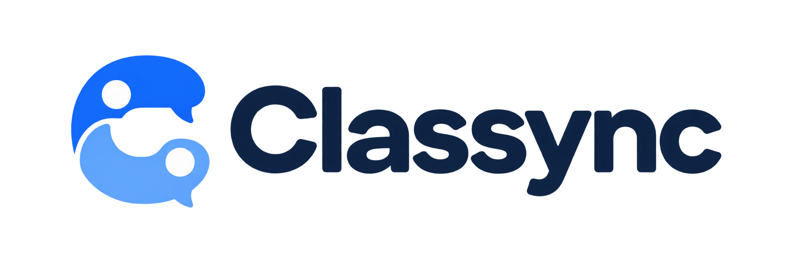
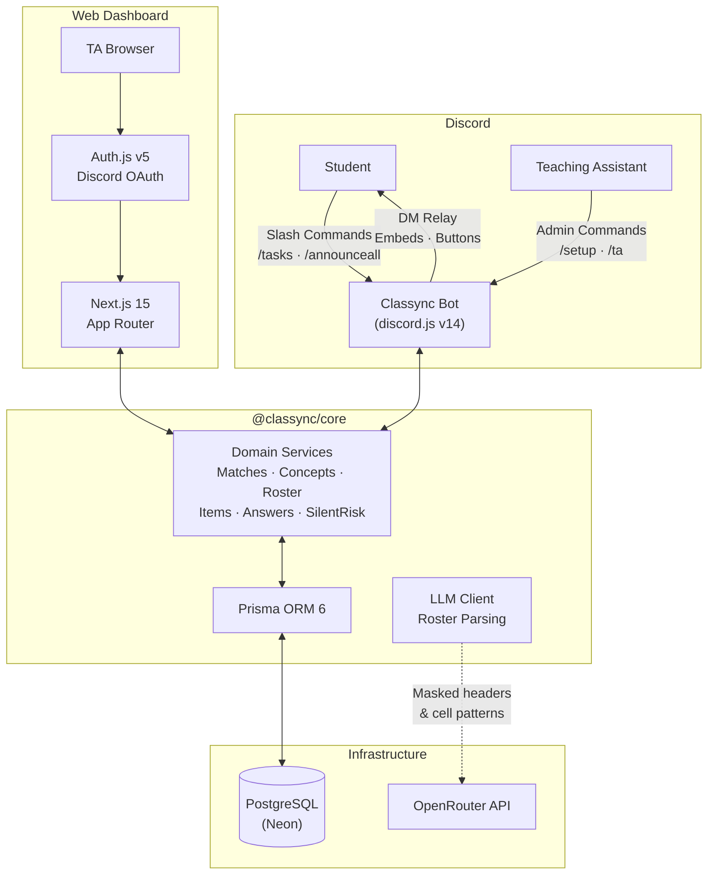

<p align="center">
  
</p>

<p align="center">
  <strong>Early-Warning Academic Support System &amp; Classroom Peer Collaboration</strong>
</p>

<p align="center">
  <em>Detect struggling students before the grade drops — anonymously, empathetically, automatically.</em>
</p>

<p align="center">
  <a href="https://ifest.himatifunpad.org/"></a>
  <a href="LICENSE"></a>
  <a href="https://www.typescriptlang.org/"></a>
  <a href="https://discord.js.org/"></a>
  <a href="https://nextjs.org/"></a>
  <a href="https://www.prisma.io/"></a>
  <a href="https://neon.tech/"></a>
</p>

---

## Table of Contents

- [About](#about)
- [Why Classync?](#why-classync)
- [Features](#features)
- [Architecture](#architecture)
- [Project Structure](#project-structure)
- [Getting Started](#getting-started)
  - [Prerequisites](#prerequisites)
  - [Installation](#installation)
  - [Environment Variables](#environment-variables)
  - [Database Setup](#database-setup)
  - [Register Bot Commands](#register-bot-commands)
  - [Run Locally](#run-locally)
- [Discord Server Setup](#discord-server-setup)
- [Bot Commands](#bot-commands)
- [Demo Walkthrough](#demo-walkthrough)
- [Tech Stack](#tech-stack)
- [Brand Colors](#brand-colors)
- [Privacy & Compliance](#privacy--compliance)
- [Documentation](#documentation)
- [Team](#team)
- [License](#license)

---

## About

**Classync** is a Discord bot + web dashboard system that helps teaching assistants (TAs) detect and support university students who are silently falling behind — before it shows up in their grades.

Students interact with the bot through **private, ephemeral slash commands**. TAs manage assignments and monitor class health from a **real-time web dashboard**. When enough students struggle with the same concept, the system surfaces aggregated (never individual) signals to the TA, and connects struggling students with peers who can help.

Built by **Team BudakGPT** (Universitas Indonesia) for the [Informatics Festival (IFest) 2026 Hackathon](https://ifest.himatifunpad.org/) — Theme: *Tech for Human Connections*, Sub-theme: *Receiver & Provider*.

---

## Why Classync?

The problem is well-documented:

| Finding | Source |
|---|---|
| **47.9%** of students avoid seeking academic help due to embarrassment and fear of social judgment | Alotaibi et al. (2026), n=1,134, Fig. 3 |
| Students significantly prefer asking **classmates over faculty**, but new/transfer students lack peer networks | Qayyum (2018), n=438 |
| TAs spend **5–8 hours/week** answering the same DMs while announcements get buried in chat noise | Observed across Indonesian university Discord servers |

Existing tools (LMS forums, WhatsApp groups, public Discord threads) force students to ask for help **publicly**, which is exactly what the struggling students won't do.

Classync flips this: help-seeking is **private by default**, and information only flows to TAs when enough students share the same struggle.

---

## Features

### For Students

- **Private Task Checklist** — `/tasks` shows an ephemeral (only-you) assignment dashboard with status tracking (*Not Started → In Progress → Done / Stuck*)
- **Anonymous Difficulty Reporting** — Mark a concept you're stuck on without anyone knowing. The system only reveals aggregated counts (≥ 5 students) — never individual identities
- **Peer Helper Matching** — Request anonymous help from a classmate who already finished the assignment. Chat via bot-relayed DMs. Reveal identities only if both sides agree
- **Instant TA Answers** — When a TA answers a concept question, you get the answer delivered to your DMs automatically
- **Privacy Controls** — Full consent flow before any data is collected. Delete all your data at any time with one click

### For Teaching Assistants

- **Web Dashboard** — Real-time overview of assignment health: concept heatmaps, help request queues, silent-risk alerts
- **Silent-Risk Detection** — Identifies students who haven't interacted with assignments due in < 7 days (the "gone quiet" students)
- **Answer Once, Deliver Many** — Write a response to a concept once; the bot delivers it to every stuck student and pins it in the concept's discussion room
- **Proactive Announcements** — `/ta add-item announce:true` broadcasts an interactive task card to the announcement channel
- **AI Roster Import** — Upload any `.xlsx` / `.csv` class roster. AI identifies columns (NPM, Name, Class) using masked structural patterns — zero PII sent to LLMs

### Server Management

- **One-Command Setup** — `/setup auto` or `/setup form` provisions categories, channels (`#verifikasi`, `#pengumuman-tugas`, per-class channels), and roles (`@Verified`, `@TA`, `@Kelas A`, etc.)
- **Idempotent & Non-Destructive** — Re-running `/setup` reuses existing channels/roles instead of creating duplicates. Database is never wiped
- **Identity Verification Gate** — Students verify their NPM in `#verifikasi` → auto-assigned roles + nickname set to `NPM - Name`
- **Concept Discussion Rooms** — Dynamic private channels created per concept, with due-date-gated moderation

---

## Architecture



The monorepo has three workspaces sharing one database through `@classync/core`:

| Workspace | Purpose | Runtime |
|---|---|---|
| `apps/bot` | Discord slash commands, DM relay, cron jobs | Node.js (tsx) |
| `apps/web` | TA dashboard, roster upload, auth | Next.js 15 |
| `packages/core` | Prisma schema, domain services, LLM client | Shared library |

---

## Project Structure

```
Classync/
├── apps/
│   ├── bot/                        # Discord Bot
│   │   └── src/
│   │       ├── commands/           # Slash command builders
│   │       │   ├── setup.ts        #   /setup (auto | form | panel | channel)
│   │       │   ├── tasks.ts        #   /tasks
│   │       │   ├── ta.ts           #   /ta (add-item | queue | answer | close-room | announce-all)
│   │       │   └── announceall.ts  #   /announceall
│   │       ├── interactions/       # Button/modal/select handlers
│   │       │   ├── setup.ts        #   Setup wizard interactions
│   │       │   ├── setupReset.ts   #   Double-confirm reset flow
│   │       │   ├── tasks.ts        #   Student checklist interactions
│   │       │   ├── tasksStuck.ts   #   Stuck concept reporting
│   │       │   ├── ta.ts           #   TA management interactions
│   │       │   ├── match.ts        #   Peer matching lifecycle
│   │       │   ├── relay.ts        #   Anonymous DM relay
│   │       │   ├── helper.ts       #   Peer helper volunteering
│   │       │   ├── rooms.ts        #   Concept room interactions
│   │       │   ├── announce.ts     #   Announcement interactions
│   │       │   └── verification.ts #   NPM verification handler
│   │       ├── jobs/               # Background cron tasks
│   │       │   ├── deliver.ts      #   Answer outbox delivery
│   │       │   ├── matchExpiry.ts  #   30-min match expiration
│   │       │   └── reminders.ts    #   H-24 deadline reminders
│   │       ├── academicSetup.ts    # Idempotent channel/role provisioning
│   │       ├── announcements.ts    # Task broadcast embed builder
│   │       ├── classCategories.ts  # Per-class Discord categories
│   │       ├── teardown.ts         # Safe channel cleanup
│   │       ├── topicRooms.ts       # Concept room lifecycle
│   │       ├── verificationGate.ts # #verifikasi onboarding
│   │       └── index.ts            # Bot entrypoint & event routing
│   │
│   └── web/                        # Next.js 15 TA Dashboard
│       └── src/
│           ├── app/                # App Router pages
│           │   └── g/[guildId]/    #   Guild-scoped dashboard views
│           ├── actions/            # Server Actions
│           │   ├── answers.ts      #   Submit TA answers
│           │   └── roster.ts       #   Upload roster, toggle auth
│           ├── components/         # React components
│           │   ├── HeatMap.tsx     #   7-day concept difficulty grid
│           │   ├── SilentRisk.tsx  #   "Gone quiet" student alerts
│           │   └── ui/Brand.tsx    #   Logo & branding components
│           └── auth.ts             # Auth.js v5 Discord OAuth
│
├── packages/
│   └── core/                       # Shared Domain Layer (@classync/core)
│       ├── prisma/
│       │   ├── schema.prisma       # 12 models (Guild, Student, Item, Concept, Match, etc.)
│       │   ├── seed.ts             # Demo data seeder
│       │   └── clear.ts            # Safe database truncation
│       └── src/
│           ├── services/           # Business logic
│           │   ├── matches.ts      #   Receiver ↔ Provider peer matching
│           │   ├── concepts.ts     #   Concept normalization & privacy floor
│           │   ├── roster.ts       #   NPM lookup & verification
│           │   ├── rosterParser.ts #   SheetJS + AI column inference
│           │   ├── items.ts        #   Assignment CRUD
│           │   ├── answers.ts      #   Answer outbox & delivery
│           │   ├── silentRisk.ts   #   "Gone quiet" risk aggregation
│           │   ├── students.ts     #   Student consent & data management
│           │   └── ...             #   guilds, dashboard, status, requests, topicRooms
│           ├── llm.ts              # OpenRouter client (Zod-validated)
│           └── db.ts               # Prisma client singleton
│
├── docs/                           # Documentation
│   ├── PRD.md                      # Product Requirements Document
│   ├── PRD-PITCH-DECK.md           # Pitch deck blueprint
│   ├── DEMO_SCRIPT.md              # Step-by-step demo guide
│   └── ...
├── asset/                          # Brand assets (logo)
├── PERUBAHAN.md                    # IFest evaluation: changes & justifications
├── .env.example                    # Environment variable template
├── package.json                    # Root workspace config
└── LICENSE                         # Apache 2.0
```

---

## Getting Started

### Prerequisites

| Requirement | Version |
|---|---|
| [Node.js](https://nodejs.org/) | ≥ 20.0 |
| [npm](https://www.npmjs.com/) | ≥ 10.0 |
| PostgreSQL database | Any provider ([Neon](https://neon.tech/) recommended) |
| Discord application | [Developer Portal](https://discord.com/developers/applications) |

### Installation

```bash
git clone https://github.com/BudakGPT/Classync.git
cd Classync
npm install
```

### Environment Variables

```bash
cp .env.example .env
```

Fill in `.env` with your credentials:

| Variable | Required | Description |
|---|:---:|---|
| `DATABASE_URL` | ✅ | PostgreSQL connection string |
| `DISCORD_TOKEN` | ✅ | Bot token from Developer Portal → Bot |
| `DISCORD_CLIENT_ID` | ✅ | Application ID from Developer Portal → General |
| `DISCORD_CLIENT_SECRET` | ✅ | OAuth2 secret for web dashboard login |
| `DISCORD_GUILD_ID` | ✅ | Your test server ID (right-click server → Copy Server ID) |
| `AUTH_SECRET` | ✅ | Random string for Auth.js sessions. Generate: `openssl rand -base64 32` |
| `WEB_URL` | | Dashboard URL for bot embeds. Default: `http://localhost:3000` |
| `OPENROUTER_API_KEY` | | Enables AI-powered roster column detection. Without it, header heuristics are used |
| `OPENROUTER_MODEL` | | Model override. Default: `google/gemini-2.0-flash-lite-preview-02-05:free` |

### Database Setup

```bash
npm run db:push       # Push Prisma schema to PostgreSQL
npm run db:generate   # Generate Prisma Client typings
npm run db:seed       # (Optional) Seed demo data for testing
```

Other database commands:

```bash
npm run db:clear      # Truncate all records (keeps schema)
npm run db:reset      # Full schema reset (prisma db push --force-reset)
```

### Register Bot Commands

Deploy slash commands to your test guild:

```bash
npm run register
```

### Run Locally

Open two terminals:

```bash
# Terminal 1 — Discord Bot
npm run dev:bot

# Terminal 2 — Web Dashboard
npm run dev:web
```

The web dashboard runs at **http://localhost:3000**.

---

## Discord Server Setup

After the bot is running and invited to your server (scopes: `bot`, `applications.commands`):

1. **Run `/setup auto`** or **`/setup form`** to provision the academic server structure:
   - Creates `#verifikasi` (identity verification channel)
   - Creates `#pengumuman-tugas` (task announcements)
   - Creates per-class categories and channels (e.g., `📚 Kelas A`)
   - Creates roles: `@Verified`, `@TA`, `@Kelas A`, `@Kelas B`, etc.

2. **Upload a roster** on the web dashboard (Roster tab) — students appear in the verification queue.

3. **Students verify** in `#verifikasi` by entering their NPM → auto-assigned roles and nickname.

4. **Create assignments** with `/ta add-item` → students see them in `/tasks`.

---

## Bot Commands

### Student Commands

| Command | Description |
|---|---|
| `/tasks` | Open your private assignment dashboard. Mark progress, report difficulties, request peer help. |

### TA Commands

| Command | Description |
|---|---|
| `/ta add-item` | Create an assignment. Options: `title`, `due`, `description`, `kind`, `announce` |
| `/ta queue` | View pending help requests from students |
| `/ta answer` | Submit an answer to a concept — auto-delivered to all stuck students |
| `/ta close-room` | Close a concept discussion room (due-date protection applies) |
| `/ta announce-all` | Broadcast all active assignments to the announcement channel |
| `/announceall` | Shortcut for `/ta announce-all` |

### Admin Commands

| Command | Description |
|---|---|
| `/setup auto` | Auto-provision server with default settings from database roster |
| `/setup form` | Setup with manual input (course name, semester, class list) |
| `/setup panel` | Deploy the verification panel embed in `#verifikasi` |
| `/setup channel` | Point the bot to an existing announcement channel |

---

## Demo Walkthrough

A full 7-step demo script is available at [`docs/DEMO_SCRIPT.md`](docs/DEMO_SCRIPT.md). Quick overview:

```
1. TA runs /setup form → server channels and roles are created
2. TA uploads roster on web dashboard → student list imported
3. Student verifies in #verifikasi → gets @Verified + class role
4. TA runs /ta add-item announce:true → task card posted to #pengumuman-tugas
5. Student runs /tasks → marks "Stuck" on a concept
6. 5+ students flag same concept → aggregated signal appears on TA dashboard
7. TA answers from dashboard → all stuck students get the answer via DM
```

Peer matching flow:
```
1. Stuck student clicks "Request Peer Help"
2. Bot finds a classmate who marked "Done" on the same item
3. Both chat anonymously through bot-relayed DMs
4. Either side can click "Reveal Identity" (requires mutual consent)
```

---

## Tech Stack

| Layer | Technology |
|---|---|
| **Bot** | [discord.js](https://discord.js.org/) v14, TypeScript, [node-cron](https://www.npmjs.com/package/node-cron) |
| **Web** | [Next.js](https://nextjs.org/) 15 (App Router, Server Actions, RSC), [Tailwind CSS](https://tailwindcss.com/) v4, [Auth.js](https://authjs.dev/) v5 |
| **Database** | [Prisma](https://www.prisma.io/) 6, PostgreSQL ([Neon](https://neon.tech/)) |
| **Validation** | [Zod](https://zod.dev/) |
| **Spreadsheet** | [SheetJS](https://sheetjs.com/) (xlsx) |
| **AI** | [OpenRouter](https://openrouter.ai/) (masked roster parsing only) |
| **Monorepo** | npm workspaces |

---

## Brand Colors

| Name | Hex | Sample |
|---|---|---|
| Sync Blue | `#136AFB` |  |
| Sky Blue | `#60A4FC` |  |
| Navy | `#0E2343` |  |
| Soft White | `#FDFDFD` |  |
| Ice Blue | `#EDF4FF` |  |
| Mist Blue | `#C9DDFC` |  |

---

## Privacy & Compliance

Classync is designed around **Privacy by Design**, compliant with Indonesia's [UU PDP (No. 27/2022)](https://peraturan.bpk.go.id/Details/229798/uu-no-27-tahun-2022):

| Principle | Implementation |
|---|---|
| **Explicit Consent** | Students must accept a consent agreement before `/tasks` collects any data |
| **Right to be Forgotten** | One-click data deletion removes all statuses, requests, matches, and room memberships |
| **Data Minimization** | Relay messages between peers are forwarded in real-time, never stored in the database |
| **Zero PII to AI** | Roster parsing masks cell contents to structural patterns (`digits→9`, `letters→a`) before LLM inference |
| **No Grade Coupling** | Classync data is fully separated from academic grading — no penalty risk for seeking help |
| **Privacy Floor** | Individual difficulty reports are never exposed until ≥ 5 students share the same concept |

---

## Documentation

| Document | Description |
|---|---|
| [`docs/PRD.md`](docs/PRD.md) | Product Requirements Document |
| [`docs/DEMO_SCRIPT.md`](docs/DEMO_SCRIPT.md) | Step-by-step demo for judges/evaluators |
| [`docs/DECISIONS.md`](docs/DECISIONS.md) | Architecture decision records |
| [`docs/PRD-PITCH-DECK.md`](docs/PRD-PITCH-DECK.md) | Pitch deck blueprint & speaker notes |
| [`PERUBAHAN.md`](PERUBAHAN.md) | IFest evaluation document: changes, justifications, and empirical citations |

---

## Team

**Team BudakGPT** — Universitas Indonesia

| Name | Role |
|---|---|
| **Erik Wilbert** | Team Lead · Bot Engineer |
| **Helven Marcia** | System Architect · Integrator |
| **Haekal Handrian** | Frontend · Web Engineer |
| **Malik Alifan Kareem** | Product Lead · Pitch & QA |

---

## License

Licensed under the [Apache License 2.0](LICENSE).

```
Copyright 2026 Team BudakGPT — Universitas Indonesia

Licensed under the Apache License, Version 2.0 (the "License");
you may not use this file except in compliance with the License.
You may obtain a copy of the License at

    http://www.apache.org/licenses/LICENSE-2.0
```