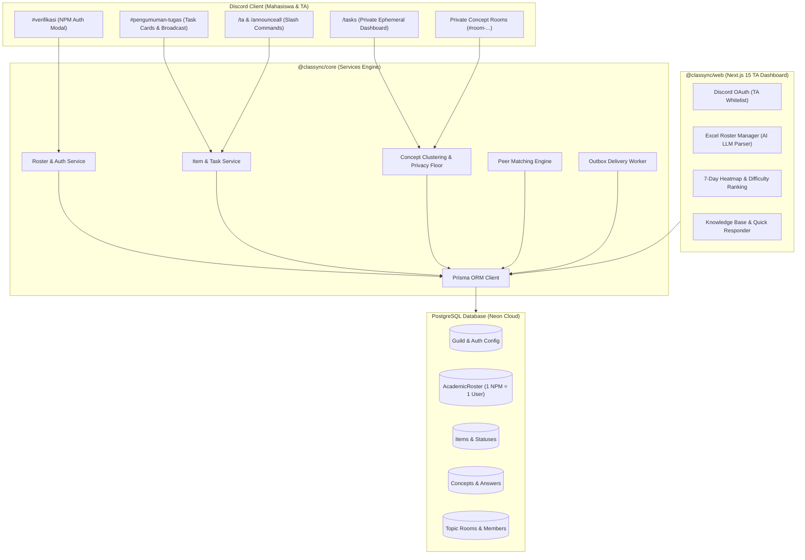

# Classync — Final Product Requirements Document (PRD) & Pitch Deck Blueprint
**IFest 2026 Hackathon · Informatics Festival Universitas Padjadjaran**  
**Tema:** *Tech for Human Connections* — **Sub-tema:** *Receiver & Provider*  
**Tim Pengembang:** BudakGPT (Erik Wilbert, Helven Marcia, Malik Alifan Kareem, Haekal Handrian)  
**Versi:** 3.0 (Production-Ready Release) · **Tanggal:** 18–19 September 2026

---

## 1. Executive Summary & Pitch Narrative

### 1.1 Problem Statement (The Silent Struggle)
* **Kenyataan di Lapangan:** Lebih dari **47.9% mahasiswa** enggan mencari bantuan akademik saat mengalami kesulitan karena rasa malu, takut dihakimi (*impostor syndrome*), dan khawatir terhadap citra diri (Alotaibi et al., 2026).
* **Kesenjangan Jaringan Informal:** Mahasiswa cenderung bertanya kepada teman dekat daripada dosen/asisten (Qayyum, 2018). Mahasiswa baru, pendiam, atau tanpa jejaring pertemanan (*circle*) di kelas akhirnya tertinggal dalam kesunyian (*the silent struggle*).
* **Beban Berulang Tim Pengajar (TA Burnout):** Asisten Dosen (TA) menjawab pertanyaan yang sama berulang kali di berbagai kanal pribadi (DM Discord/WhatsApp). Tidak ada sentralisasi kesulitan konsep kelas.
* **Informasi yang Tertimbun:** Pengumuman tugas dan deadline penting di server Discord kelas seringkali tenggelam oleh obrolan harian (*chat noise*).

### 1.2 Solusi: Classync
**Classync** adalah ekosistem terpadu berupa **Discord Bot cerdas + Web Dashboard Asisten Dosen** yang mengubah ruang kelas Discord menjadi lingkungan akademik yang aman, transparan, dan proaktif:
1. **Perlindungan Privasi:** Mahasiswa menandai kesulitan (*stuck*) secara anonim. Identitas tidak pernah bocor ke publik atau dosen.
2. **Ambang Privasi (Privacy Floor $\ge 5$):** Menghilangkan rasa malu dengan membuktikan *“Kamu tidak sendirian”* ketika $\ge 5$ teman mengalami kesulitan pada konsep yang sama.
3. **Koneksi Dua Arah (*Receiver & Provider*):** Mahasiswa yang kesulitan dapat dihubungkan secara anonim dengan rekan sekelas yang sudah menyelesaikan tugas (*Peer Helper*), atau masuk ke **Private Concept Room** bersama TA.
4. **Otomasi Onboarding Akademik:** Auto-setup server lengkap, verifikasi identitas 1 NPM = 1 Akun, sinkronisasi nama/role otomatis, dan pembuatan kategori kelas privat berbasis impor Excel dengan AI parsing.
5. **Sistem Pengumuman & Broadcast Proaktif:** Tugas otomatis disiarkan ke channel pengumuman dengan tombol aksi instan, plus perintah `/announceall` untuk rekap tugas aktif.

---

## 2. Struktur Slide Pitch Deck (Slide-by-Slide Blueprint)

Berikut adalah panduan slide siap pakai untuk tim presenter saat menyusun pitch deck PowerPoint / Canva:

| Slide # | Judul Slide | Konten Kunci & Visual | Pesan Utama |
|---|---|---|---|
| **Slide 1** | **Classync: Early-Warning Academic Support** | Logo Classync, tagline *"Tech for Human Connections: Menghubungkan Mahasiswa Tanpa Rasa Malu"*, nama tim BudakGPT. | Hook awal yang kuat dan profesional. |
| **Slide 2** | **The Silent Struggle in Academic Classes** | Statistik 47.9% mahasiswa malu bertanya (Alotaibi, 2026), grafik *chat noise* Discord, kutipan mahasiswa *"Aku bingung tapi gak enak nanya"*. | Masalah nyata, mendesak, dan dekat dengan kehidupan juri/mahasiswa. |
| **Slide 3** | **Existing Solutions & Their Failure** | Perbandingan: LMS (kaku, jarang dibuka) vs WhatsApp/Discord (berisik, tertimbun) vs Ticket Bot (individual, tidak ada agregasi konsep). | Menunjukkan celah pasar (*unfair advantage*). |
| **Slide 4** | **Introducing Classync** | Diagram makro: Discord Bot (Student-facing) $\leftrightarrow$ Prisma Core $\leftrightarrow$ TA Web Dashboard (Teacher-facing). | Solusi elegan tanpa memaksa mahasiswa pindah platform. |
| **Slide 5** | **Feature 1: AI Roster & Identity Gate** | Screenshot Web Roster Upload (Excel AI parser) $\rightarrow$ Discord `#verifikasi` $\rightarrow$ Auto-role `@Verified`, `@Mahasiswa`, `@Kelas A`, Auto-nickname `NPM - Nama`. | Keamanan akademik ketat: 1 Mahasiswa = 1 Akun Discord valid. |
| **Slide 6** | **Feature 2: Private Checklist & Silent Stuck** | Screenshot UI `/tasks` ephemeral $\rightarrow$ Tombol *In Progress*, *Done*, *Stuck* $\rightarrow$ Concept picker. | Privasi absolut. Data status tidak pernah terlihat orang lain. |
| **Slide 7** | **Feature 3: Tech for Human Connections** | Alur *Receiver & Provider*: Peer matching anonim dengan teman yang *Done*, serta *Private Concept Rooms* untuk diskusi terarah bersama TA. | Memenuhi tema IFest 2026 secara langsung dan berdampak. |
| **Slide 8** | **Feature 4: Proactive Broadcasting** | `/ta add-item (announce: true)` dan `/announceall` yang mengirim embed interaktif ke `#pengumuman-tugas` lengkap dengan tombol aksi langsung. | Informasi tugas tidak akan pernah tertimbun lagi. |
| **Slide 9** | **Feature 5: Real-time TA Dashboard** | Screenshot Dashboard Web: Heatmap kesulitan 7 hari, Difficulty List peringkat konsep tersulit, editor jawaban kilat. | TA menjawab 1 kali, otomatis terkirim dan tersimpan untuk semua mahasiswa. |
| **Slide 10** | **Privacy, Security & Compliance** | UU PDP No. 27/2022 & GDPR compliance: *Consent screen*, *Privacy Floor $\ge 5$*, data revocation & purge button, pemisahan dari sistem nilai (*zero-grading risk*). | Kepatuhan hukum dan etika data yang matang. |
| **Slide 11** | **Live Demo / User Journey** | Alur singkat 90 detik: TA upload roster $\rightarrow$ Mahasiswa verifikasi $\rightarrow$ Mahasiswa klik Stuck $\rightarrow$ TA lihat di web $\rightarrow$ Jawaban terkirim. | Bukti nyata aplikasi berjalan stabil dan responsif. |
| **Slide 12** | **Impact & Future Roadmap** | Metrik: Turunnya angka *dropout*, penghematan 70% waktu asdos, integrasi Canvas/Moodle, ekspansi multi-kampus. Penutup & Q&A. | Visi jangka panjang dan kelayakan komersial/akademik. |

---

## 3. Arsitektur Teknis & Komponen Sistem

---

## 4. Spesifikasi Fitur Utama & Kriteria Penerimaan

### 4.1 Onboarding Akademik & Gerbang Verifikasi Identitas (Auth Gate)
* **AI Roster Parser:** Web dashboard menerima file `.xlsx`, `.xls`, `.csv`. Model AI OpenRouter (dengan fallback heuristik) secara otomatis mendeteksi kolom NPM, Nama, dan Kelas tanpa mengharuskan template kaku.
* **1 NPM = 1 Discord Account:** Relasi satu-ke-satu diverifikasi secara unik (`@@unique([guildId, npm])` dan `@@unique([guildId, discordUserId])`).
* **Automated Provisioning:** Saat `/setup auto` dijalankan:
  * Membuat struktur channel dan kategori: `📢 INFORMASI AKADEMIK`, `💬 DISKUSI UMUM`, `🔒 RUANG TA & DOSEN`, `🔐 GERBANG VERIFIKASI`.
  * Membuat kategori terisolasi per kelas: `📁 KELAS A`, `📁 KELAS B`, dst.
  * Membuat role `@Verified`, `@Mahasiswa`, `@Teaching Assistant`, `@Dosen Pengampu`, dan role kelas.
  * Mahasiswa baru hanya dapat melihat `#verifikasi`. Setelah memasukkan NPM yang cocok, otomatis mendapatkan role dan nama server berubah menjadi `NPM - Nama Lengkap`.
* **Idempotensi & Teardown Protection:** Re-run `/setup` dilindungi dialog konfirmasi bertingkat (*double confirmation*) yang mencegah penghapusan data secara tidak sengaja, namun mendukung reset bersih saat semester baru.

### 4.2 Pelacak Tugas & Kesulitan Privat (*Silent Stuck*)
* **Ephemeral User Experience:** Command `/tasks` hanya terlihat oleh mahasiswa yang memanggilnya. Teman sekelas atau dosen tidak dapat melihat tugas yang sedang dikerjakan.
* **4 Status Pengerjaan:** `NONE` (⚪), `IN_PROGRESS` (🔵), `DONE` (✅), `STUCK` (🔴).
* **Concept Label Tagging:** Ketika memilih *Stuck*, mahasiswa memilih konsep yang membingungkan atau mengetik konsep baru.
* **Privacy Floor ($\ge 5$):** Jika jumlah mahasiswa yang terjebak pada suatu konsep $< 5$, sistem hanya menampilkan pesan *"Tersimpan secara privat"*. Hanya ketika pelapor mencapai $\ge 5$, muncul notifikasi *"🔴 5 mahasiswa lain juga mengalami kesulitan pada topik ini. Kamu tidak sendirian."*
* **Zero-Grading Risk:** Data kesulitan disimpan secara independen dan tidak pernah dihubungkan ke sistem penilaian akademik.

### 4.3 Fitur Koneksi: Peer Matching & Private Concept Rooms (*Receiver & Provider*)
* **Peer Helper Matching:** Mahasiswa yang menandai tugas *Done* dapat memilih menjadi sukarelawan penolong (*Helper Opt-In*). Mahasiswa yang *Stuck* dapat dipasangkan secara anonim. Pesan diteruskan (*relayed*) oleh bot tanpa membocorkan identitas sampai kedua pihak sepakat membuka identitas.
* **Private Concept Rooms:** Ruang diskusi terisolasi (`#room-[item]-[concept]`) yang dibuat otomatis ketika banyak mahasiswa kesulitan pada topik yang sama.
* **Due-Date Gated Moderation:** Room terkunci dari penutupan sebelum deadline tugas berakhir agar mahasiswa tetap dapat berdiskusi hingga menit terakhir.

### 4.4 Sistem Penyiaran Tugas Proaktif (*Task Announcements & Broadcast*)
* **Auto-Announce on Create:** Pada command `/ta add-item`, terdapat parameter boolean `announce` (default: `true`).
  * Jika `true`: Bot langsung menyiarkan kartu pengumuman tugas ke channel `#pengumuman-tugas` lengkap dengan deadline berformat waktu lokal Discord (`<t:TIMESTAMP:F>`) dan tombol interaktif `📋 Buka Tugas Saya` & `🙋 Tanya / Diskusi`.
  * Jika `false`: Tugas dibuat tanpa menyiarkan pesan publik.
* **Command `/announceall`:** Command khusus TA/Owner untuk menyiarkan ringkasan seluruh tugas yang sedang aktif (belum melewati deadline) dalam bentuk katalog embed interaktif di `#pengumuman-tugas`.
* **Edge Case Handling:**
  * Penanganan channel terhapus/belum diatur dengan panduan perintah perbaikan.
  * Pengecekan izin *Send Messages* & *Embed Links*.
  * Pembatasan kuota Discord 25 embed fields dengan indikator sisa item.

### 4.5 Web Dashboard Asisten Dosen (Next.js 15)
* **Role-Based Access Control:** Login Discord OAuth; hanya ID yang terdaftar dalam `taUserIds` yang diizinkan masuk.
* **7-Day Struggle Heatmap:** Visualisasi matriks tugas $\times$ 7 hari terakhir berdasarkan tanggal pelaporan kesulitan untuk mendeteksi lonjakan hambatan belajar secara dini.
* **Difficulty Ranking:** Daftar topik tersulit yang diurutkan berdasarkan jumlah laporan terbuka dengan indikator warna (*Red $\ge 5$*, *Yellow 3–4*, *Green $< 3$*).
* **Answer Once, Help Everyone:** Form jawaban di dashboard web langsung terkirim ke outbox delivery bot, mengirim DM ke seluruh mahasiswa yang meminta bantuan, serta menyematkan jawaban di dalam concept room.

---

## 5. Kepatuhan Privasi, Keamanan & Etika Data

Classync dirancang mematuhi **UU No. 27 Tahun 2022 tentang Pelindungan Data Pribadi (UU PDP)** dan standar internasional **GDPR**:

1. **Explicit Consent & Hak Dilupakan:** Pada interaksi pertama `/tasks`, mahasiswa disajikan layar persetujuan eksplisit. Mahasiswa dapat mencabut izin kapan saja melalui tombol **Privacy / Delete my data**, yang secara permanen menghapus data status, antrean bantuan, dan keanggotaan room.
2. **Prinsip Minimisasi Data:** Bot tidak membaca isi pesan teks di channel lain selain channel resmi dan interaksi terarah. Token Discord intents berjalan tanpa `MessageContent` pada interaksi umum.
3. **Pemisahan Identitas pada AI:** Data mahasiswa (Nama, NPM, Discord ID) tidak pernah dikirim ke model LLM. Pemrosesan AI hanya digunakan untuk segmentasi header spreadsheet saat proses upload roster.
4. **K-Anonymity & Privacy Floor:** Mencegah *de-anonymization attack* di kelas kecil dengan menahan representasi statistik hingga mencapai ambang batas $\ge 5$ mahasiswa.

---

## 6. Skenario Demo Live (90-Detik Pitch Demo Script)

1. **Menit 00:00 – 00:20 (Setup & Onboarding):**
   * TA menjalankan `/setup auto course_name:"Pemrograman Web" course_code:"CS202"`
   * Bot secara instan menyulap server kosong menjadi kampus digital lengkap dengan channel, role, dan panel interaktif.
   * TA membuka dashboard web, mengunggah `roster_mahasiswa.csv`. Dalam 2 detik, data 30 mahasiswa terdeteksi.
2. **Menit 00:20 – 00:45 (Verifikasi Mahasiswa):**
   * Mahasiswa baru masuk ke Discord, hanya melihat `#verifikasi`.
   * Klik tombol **Verifikasi Identitas**, masukkan NPM `2206081234`.
   * Seketika role `@Verified`, `@Mahasiswa`, dan `@Kelas A` terpasang; nickname berubah menjadi `2206081234 - Budi Santoso`, dan channel kelas otomatis terbuka.
3. **Menit 00:45 – 01:10 (Pengumuman Tugas & Silent Struggle):**
   * TA membuat tugas `/ta add-item title:"Tugas 1: REST API" due:"2026-09-25 23:59" announce:true`.
   * Pengumuman indah langsung muncul di `#pengumuman-tugas`.
   * Mahasiswa mengklik `📋 Buka Tugas Saya`, memilih status `STUCK` pada konsep `CORS Error`. Notifikasi muncul: *"Saved privately"*.
4. **Menit 01:10 – 01:30 (Resolusi Cepat TA & Knowledge Base):**
   * Mahasiswa ke-5 menandai hal yang sama $\rightarrow$ muncul pesan solidaritas: *"🔴 5 mahasiswa lain juga stuck pada CORS Error"*.
   * TA membuka Web Dashboard, melihat lonjakan merah di Heatmap pada konsep `CORS Error`.
   * TA mengetik solusi penjelasan satu kali di web $\rightarrow$ seluruh mahasiswa yang kesulitan menerima solusi dan room diskusi otomatis terisi jawaban resmi.

---

## 7. Metrik Keberhasilan & Dampak (Impact Metrics)

| Dimensi | Sebelum Classync | Sesudah Classync |
|---|---|---|
| **Pencarian Bantuan Mahasiswa** | $< 25\%$ mahasiswa berani bertanya di ruang publik. | $> 80\%$ partisipasi pencatatan kendala lewat mode privat. |
| **Beban Waktu Asisten Dosen** | $\pm 6$ jam/minggu membalas pertanyaan duplikat di DM. | Hemat $> 70\%$ waktu; menjawab 1 kali untuk seluruh kelas. |
| **Kehilangan Deadline Tugas** | Sering terjadi karena tertimbun percakapan grup. | Notifikasi proaktif H-24 jam & integrasi katalog `/announceall`. |
| **Transparansi Evaluasi Pengajar** | Dosen baru mengetahui mahasiswa kesulitan setelah nilai ujian anjlok. | Peringatan dini (*early warning*) real-time melalui Heatmap kesulitan. |

---
*Dokumen ini merupakan acuan final implementasi dan materi presentasi tim BudakGPT pada Final IFest 2026 Hackathon.*
