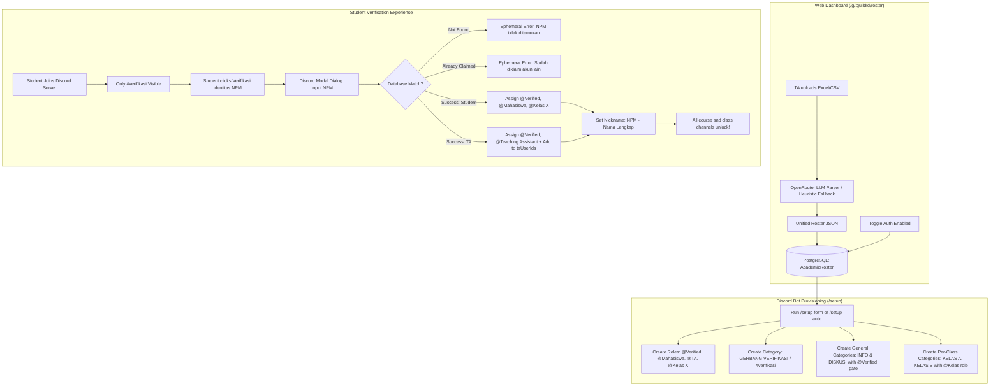

# PRD: Academic Roster, AI Spreadsheet Ingestion & Discord Verification Gate

**Document Version:** 1.0.0  
**Status:** Implemented & Verified  
**Target:** IFest 2026 Hackathon · Team BudakGPT  
**Author:** Antigravity (Classync AI Assistant) & Erik Wilbert  

---

## 1. Executive Summary

In higher-education environments, managing Discord servers for university courses requires robust identity verification and section isolation:
1. **Preventing Impersonation & Anonymous Lurking**: Students must be mapped to their official academic identity (NPM/NIM).
2. **Automated Classroom Sectioning**: Courses often have multiple class sections (*Kelas A*, *Kelas B*, *Rombel 1*, etc.) requiring distinct private spaces while sharing course-wide announcements.
3. **Frictionless Ingestion**: Lecturers and TAs manage student lists in Excel (`.xlsx`, `.xls`, `.csv`) with unpredictable headers. Classync utilizes a free-tier LLM (via OpenRouter) to parse unstructured spreadsheets into a unified JSON format with robust offline heuristic fallback.
4. **Discord Verification Gate**: Members are initially confined to an onboarding channel (`#verifikasi`). Upon submitting their NPM, the bot automatically verifies the record, assigns roles (`@Verified`, `@Mahasiswa`, `@Kelas X`, or `@Teaching Assistant`), updates the server nickname to `NPM - Nama Lengkap`, and opens course channels.

---

## 2. System Architecture & Workflows

### 2.1 End-to-End Workflow Diagram



---

## 3. Data Schema & Model Specification

### 3.1 `AcademicRoster` Model (`packages/core/prisma/schema.prisma`)

```prisma
enum RosterRole {
  STUDENT
  TA
}

model AcademicRoster {
  id            String      @id @default(cuid())
  guildId       String
  npm           String
  name          String
  role          RosterRole  @default(STUDENT)
  className     String?     // e.g. "Kelas A", "Kelas B"
  discordUserId String?
  verifiedAt    DateTime?
  createdAt     DateTime    @default(now())
  updatedAt     DateTime    @updatedAt
  guild         Guild       @relation(fields: [guildId], references: [id], onDelete: Cascade)

  @@unique([guildId, npm])
  @@unique([guildId, discordUserId])
}
```

### 3.2 Security & Integrity Invariants
* **`@@unique([guildId, npm])`**: Guarantees no duplicate NPM records within the same academic course.
* **`@@unique([guildId, discordUserId])`**: Guarantees **1 Discord Account = 1 Verified Identity**. A student cannot verify under multiple NPMs, and an NPM cannot be claimed by more than one Discord account.
* **NPM Normalization**: All NPMs are trimmed, whitespace-stripped, and uppercase-normalized (`.trim().replace(/\s+/g, "").toUpperCase()`) during both ingestion and verification.

---

## 4. LLM Spreadsheet Ingestion Engine

### 4.1 Input Formats
* **File Types**: `.xlsx`, `.xls`, `.csv` processed using `xlsx` (SheetJS).
* **Column Flexibility**: In real academic rosters, column headers vary across faculties (e.g. *NIM*, *NPM*, *No. Mahasiswa*, *Nama Mahasiswa*, *Seksi*, *Rombel*, *Kelas*).

### 4.2 Unified JSON Schema
```typescript
export interface RosterEntryInput {
  npm: string;
  name: string;
  role: "STUDENT" | "TA";
  className?: string | null;
}
```

### 4.3 OpenRouter LLM Ingestion
* **Provider**: OpenRouter API (`https://openrouter.ai/api/v1/chat/completions`).
* **Model**: Free tier models (`google/gemini-2.0-flash-lite-preview-02-05:free`, `meta-llama/llama-3.3-70b-instruct:free`, or `qwen/qwen-2.5-coder-32b-instruct:free`).
* **Prompt Contract**: Strictly returns a JSON array of `RosterEntryInput`, standardizing class names (e.g., `"A"` $\to$ `"Kelas A"`).

### 4.4 Deterministic Heuristic Fallback
If `OPENROUTER_API_KEY` is not present, the network is offline, or rate limits occur:
* Automatically detects the header row within the first 5 rows.
* Matches column positions using case-insensitive regex patterns:
  * NPM: `/(npm|nim|id|no_mahasiswa)/i`
  * Name: `/(nama|name|fullname)/i`
  * Class: `/(kelas|class|rombel|seksi)/i`
  * Role: `/(role|peran|status|asdos|ta)/i`
* Standardizes class labels: `/^[a-zA-Z]$/` $\to$ `Kelas ${uppercase}`.

---

## 5. Discord Verification Gate & Channel Isolation

### 5.1 Channel & Permission Hierarchy

| Category / Channel | Permission for `@everyone` | Permission for `@Verified` | Permission for `@Kelas A` | Permission for Staff (`@TA`, `@Dosen`) |
|---|---|---|---|---|
| **`🔐 GERBANG VERIFIKASI`** | | | | |
| └ `#verifikasi` | View, Read (No Send) | View, Read (No Send) | View, Read (No Send) | View, Read, Send |
| **`📢 INFORMASI AKADEMIK`** | Deny View | Allow View, Read | Allow View, Read | Allow View, Send |
| └ `#pengumuman-tugas` | Deny Send | Deny Send (Read Only) | Deny Send (Read Only) | Allow Send |
| └ `#jadwal-kuliah` | Deny Send | Deny Send (Read Only) | Deny Send (Read Only) | Allow Send |
| **`💬 DISKUSI UMUM`** | Deny View | Allow View, Send | Allow View, Send | Allow View, Send |
| └ `#tanya-jawab` | Deny View | Allow View, Send | Allow View, Send | Allow View, Send |
| └ `#lounge` | Deny View | Allow View, Send | Allow View, Send | Allow View, Send |
| **`📁 KELAS A` (Private Section)** | Deny View | Deny View | Allow View, Send | Allow View, Send |
| └ `#pengumuman-kelas-a` | Deny View | Deny View | Read Only | Allow Send |
| └ `#diskusi-kelas-a` | Deny View | Deny View | Allow View, Send | Allow View, Send |
| **`🔒 RUANG TA & DOSEN`** | Deny View | Deny View | Deny View | Allow View, Send |

---

## 6. Edge Cases & Side Case Handling

| # | Edge Case / Failure Mode | Mitigating Implementation |
|---|---|---|
| 1 | **Discord Nickname Length Limit (32 chars)** | If `${entry.npm} - ${entry.name}` exceeds 32 chars, it is safely sliced with `.slice(0, 32)` preventing Discord API 400 Bad Request. |
| 2 | **Server Owner Nickname Modification** | Discord API prohibits bots from modifying the server owner's nickname. The call is wrapped in `.catch(() => undefined)` to prevent uncaught exceptions. |
| 3 | **Bot Role Hierarchy Below Member** | If an admin or privileged user verifies, Discord prevents the bot from altering higher-hierarchy roles. Wrapped in `.catch(() => undefined)`. |
| 4 | **Re-verification by Same User** | If a verified student clicks verify again with their own NPM, the bot detects `entry.discordUserId === discordUserId` and re-applies roles with a welcome back confirmation. |
| 5 | **Attempted Multi-Identity Claim** | If account A tries to claim NPM 1 and then NPM 2, the bot detects `userOther.npm !== cleanNpm` and rejects with `DISCORD_ALREADY_VERIFIED`. |
| 6 | **Attempted Duplicate NPM Claim** | If account B tries to claim NPM 1 (already verified by account A), the bot rejects with `ALREADY_CLAIMED` and shows the claimed account tag. |
| 7 | **GDPR / Privacy Data Deletion (`/tasks` "Delete my data")** | When a student exercises their right to data deletion, `revokeAndDelete()` unlinks `AcademicRoster.discordUserId = null, verifiedAt = null` to avoid orphaned locks. |
| 8 | **Re-running `/setup auto`** | Channel and category creation is idempotent; checks `c.name.toLowerCase() === name.toLowerCase()` before creating to prevent duplicate channels. |
| 9 | **Manual TA Addition Preservation** | Manual slash commands (`/setup add-ta`, `/setup remove-ta`) and manual Discord role assignments remain fully supported without conflict. |
