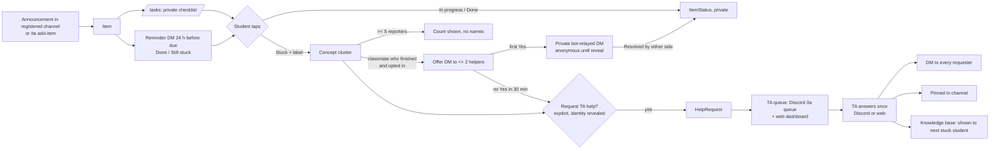

# Classync — Hack Day Progress Log

Team BudakGPT · IFest 2026 Hackathon · Universitas Padjadjaran, 18–19 Sep 2026
Erik Wilbert (bot) · Helven Marcia (integrator) · Malik Alifan Kareem (pitch/QA) · Haekal Handrian (web)

This log satisfies guidebook rule 10 (document progress, including changes to the workflow/flowchart) and rule 9 (6-hour checkpoints). The integrator writes an entry at every checkpoint. Entries are append-only; never rewrite an earlier one.

**Hack Day start:** ____ (fill in exact time at the start) · **Committee GitHub account invited at:** ____

---

## Planned flow (as submitted in the exsum, simplified for 24 h)

### Scope decisions made before the start (18 Sep 2026)

| Change vs exsum | Decision | Reason |
|---|---|---|
| Fastify HTTP API | Removed; Next.js server actions/route handlers are the HTTP layer | One fewer process; same architecture diagram |
| LLM label merging | Replaced by deterministic normalization + select existing label | Invisible in a demo; removes a failure point |
| Quiz/exam confirmation, `/split`, `/reanswer`, class-section roles, audit log, `/help` | Cut | 24 h from scratch; none affects the core loop |
| Personal reminders | Promoted to MVP | Funnel into the stuck signal; answers "what if nobody taps" |
| TA dashboard heat map + knowledge base | Added to MVP | Make clustering and reuse visible |
| Auto-ingest of announcements | Kept, built last, with `/ta add-item` fallback | Only feature that can fail on stage |

Flowchart changes made during Hack Day are logged in the checkpoint entries below.

**18 Sep 2026 (peer matching, integrator):** the flow gained one branch, Stuck → classmate who finished → private
relay → Resolved, with the TA path as the fallback after 30 minutes. Spec: `docs/personal_handoff/peer-matching-handoff.md`.

---

## Checkpoint 1 — T-18 (hour 6) · time: 14:30

**Done (merged to `main`, verified by QA on the demo script):**
- Replaced public forum threads with private concept rooms (`#help-[concept]`) grouped under per-assignment categories (`📁 [Assignment Title]`).
- Implemented voluntary student join with single-click room entry without requiring Stuck status.
- Implemented due-date-gated closure for concept rooms and bulk cleanup.
- Implemented 2-minute debounced TA DMs on room activity.
- Created `/setup auto`, `/setup form` modal dialog, roles provisioning, and persistent Classync Quick-Panel buttons in Discord channels.

**In progress:**
- Academic roster management, spreadsheet ingestion, and student identity verification gate.

**Blocked / risks:**
- None.

**Flowchart or scope changes since last entry:**
- Transitioned discussion architecture from Discord Forums to private channel concept rooms under per-assignment categories.

**Next 6 hours:**
- Deliver Excel/CSV roster upload on dashboard with OpenRouter LLM ingestion, Discord verification gate (`#verifikasi`), automatic role assignment (`@Verified`, `@Mahasiswa`, `@Kelas X`, `@Teaching Assistant`), and server nickname synchronization (`NPM - Nama Lengkap`).

---

## Checkpoint 2 — T-12 (hour 12) · time: 16:15

**Done:**
- Web Dashboard Roster Management (`/g/:guildId/roster`): Upload Excel/CSV for students and TAs, toggle verification gate, view live verification metrics and connected Discord IDs.
- AI Spreadsheet Ingestion Engine (`packages/core/src/services/rosterParser.ts`): OpenRouter API integration with free LLM models and intelligent heuristic fallback.
- Database Schema (`AcademicRoster`): Unique constraints on `[guildId, npm]` and `[guildId, discordUserId]` to enforce 1-to-1 identity mapping and prevent impersonation.
- Discord Verification Gate (`apps/bot/src/verificationGate.ts` & `interactions/verification.ts`): Private onboarding channel `#verifikasi`, interactive modal verification, automated role assignment, and nickname synchronization (`NPM - Nama Lengkap`).
- Per-Class Private Categories (`apps/bot/src/classCategories.ts`): Automated generation of isolated spaces (`📁 KELAS A`, `📁 KELAS B`) with discussion and announcement channels.

**In progress:**
- Final demo preparation and UI polish.

**Blocked / risks:**
- None. All packages typecheck cleanly.

**Flowchart or scope changes since last entry:**
-

**Next 6 hours:**
-

---

## Checkpoint 3 — T-6 (hour 18) · time: ____

Feature freeze was at T-7. From here: bug fixes, README, deploy, video, deck.

**Done:**
-

**Bugs open:**
-

**Flowchart or scope changes since last entry:**
-

**Next 6 hours:**
-

---

## Final — T-0 (hour 24) · time: ____

**Delivered:**
- Repository: ____ (tag: ____)
- Install guide: `README.md`, verified on a clean clone by ____
- Pitch deck: ____
- Demo video (≤ 5 min): ____
- Deployment (optional): ____

**Demo script status (docs/PRD.md §7):** steps passing ___ / 7

**What was cut during Hack Day and why:**
-

**Final flowchart differences vs the planned flow above:**
-
