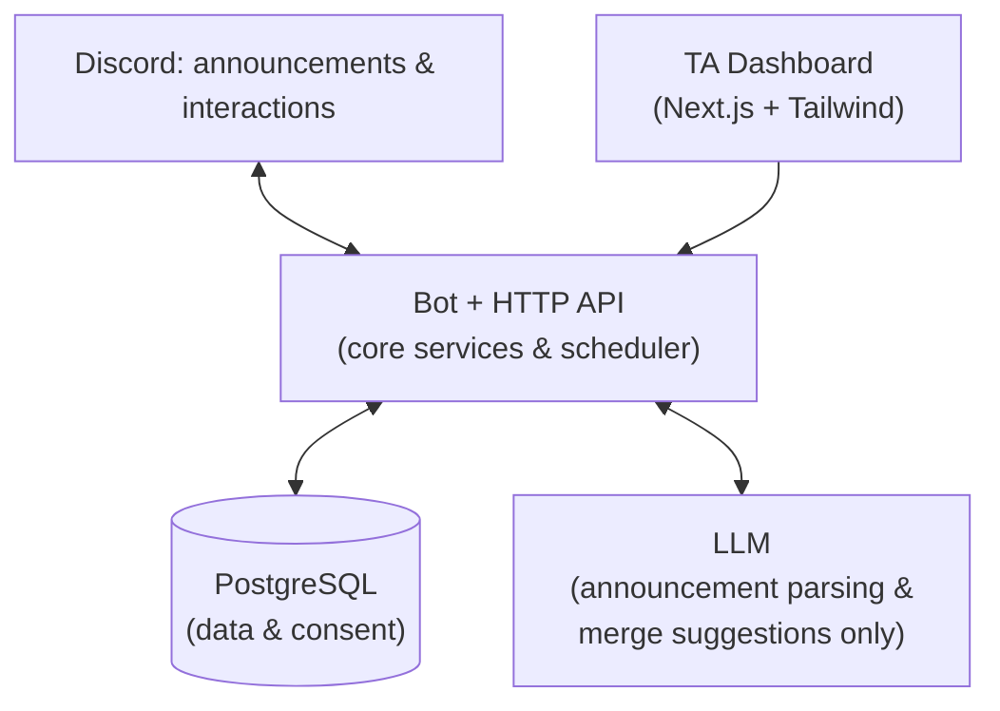
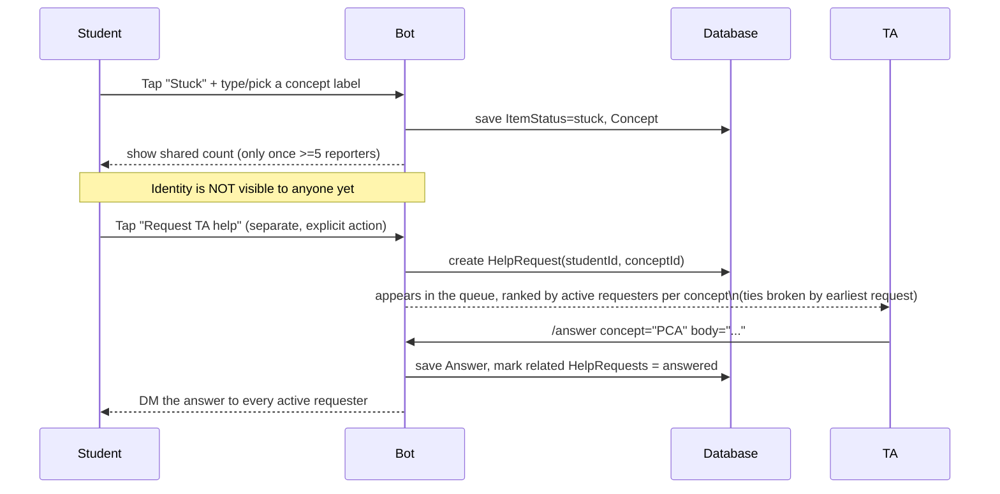

# Classync — Background Context (v3, archived)

> **Read `hackathon_execution.md` and `PRD.md` first.** This file is background from a pre-hackathon brainstorming session. Sections claiming implementation status were removed on 18 Sep 2026 because no code exists before Hack Day. Where this file and `hackathon_execution.md` disagree, the latter wins.

**IFest 2026 Hackathon** · Team BudakGPT (Erik Wilbert, Helven Marcia, Malik Alifan Kareem, Haekal Handrian — Universitas Indonesia) · Theme: *Tech for Human Connections* · Sub-theme: *Receiver & Provider*

> **Document status:** this version replaces v2. It is grounded directly in the **actual submitted exsum** (`Exsum_IFEST2026_BudakGPT.pdf`), so every scope claim below is checked against what was literally promised to the judges — not against an older draft. Written in English because the product itself (commands, UI copy) will be in English going forward. The exsum submission itself stays in Bahasa Indonesia (competition requirement) and is not affected by this change.
>
> Local setup instructions (`npm ci`, env vars, seeding, etc.) still live in `README.md` / `docs/BOT.md` and are not repeated here.

---

## 0. Read This First

1. **The exsum is now the source of truth**, not the earlier draft from a teammate. Everything in this document is checked against the PDF you submitted. Where the two disagreed, the exsum wins.
2. **Nothing is built yet.** Code starts from scratch at Hack Day (guidebook rule 7). Build order, MVP cuts and agent rules live in `hackathon_execution.md`, which overrides this file where they differ.
3. **Two things you clarified in this round, both incorporated:**
   - *"One Discord server per course (matkul) can have several classes as roles"* → added as a lightweight, optional extension (§7, §8) — **not** the heavy multi-course/Enrollment/spreadsheet-import model from the earlier teammate draft. No new roles or channels are created by the bot; it only references roles that already exist.
   - *Agreeing that the open-channel Q&A AI classifier was "too hard"* → confirmed cut. It was already excluded for a privacy reason (§4); the exsum's own text — *"the bot only reads the approved announcement channel... without analyzing any other conversation in the server"* — makes this a promise made to the judges, not just a design preference. Reviving it would also cost more build time than it's worth.
4. **Commands are being renamed to English** (§9) to match the product's target language. This is a naming/registration change only — no behavior changes.

---

## 1. Problem & Motivation (as submitted)

Students often don't ask for help even when they need it. In a mixed-methods study at Kuwait University, roughly 48% of substantive answers about *not* seeking academic support cited embarrassment or image concerns (Alotaibi et al., 2026). Separately, students tend to ask classmates before instructors (Qayyum, 2018) — which leaves students without an existing friend network with nowhere informal to turn. Avoidance of help-seeking has also been linked to lower persistence intent among STEM students (Won & Chang, 2024).

In the target class scenario: assignment announcements posted in Discord get buried under new messages. Students have to dig for deadlines. When stuck, many stay silent, while the teaching team fields the same question repeatedly through separate DMs — so both the difficulty and the answer become hard to find again.

**Three questions Classync answers:**
1. How do we keep assignment announcements easy to find, and let students track their own status without digging through chat?
2. How do we give students without a friend network a way to get help, without forcing them to expose their difficulty to the whole class?
3. How do we help the teaching team handle repeated difficulties more efficiently, and keep the resulting answers retrievable?

**Goals** map 1:1 to these:
1. Turn announcements into a personal checklist (title, deadline, kind, status).
2. Let students privately flag difficulty and consciously request help — without automatically exposing identity.
3. Cluster similar difficulties so one answer reaches many students, and persist that answer for reuse.

---

## 2. Scope Decisions (kept / added / deferred)

| Item | Decision | Why |
|---|---|---|
| Everything in the exsum's "main scope" (setup+consent, announcement processing, checklist, status, concept labels+merge, shared-difficulty count, two-step disclosure, TA queue, batch answer, personal reminders, opt-out, data deletion) | ✅ **Keep — in scope** | Confirmed against exsum §3.3/§3.5. This is the graded core. See `hackathon_execution.md` for what is MVP vs late MVP vs cut. |
| Answer reuse | ✅ **Keep — in scope** | Exsum names this the differentiator feature, prioritized right after the main flow. |
| Minimum TA dashboard (difficulty trends, `/class-overview` aggregate) | ✅ **Build now — P0** | Exsum explicitly schedules this for hours 12–18 and lists it under "advanced features." It's the one big promised piece still missing. |
| Answer pinning to the item | ✅ **Build now — P0** | Same "advanced features" list in the exsum, small effort, high demo value. |
| Lightweight multi-class-via-existing-roles | 🆕 **Added, P1, kept intentionally small** | Your clarification: one guild = one course, which can contain several class sections tagged via Discord roles that *already exist* (created manually by the TA, not by the bot). This does **not** touch the "no mass role/channel creation" exclusion below — the bot only reads roles, never creates them. See §7–§8 for the minimal schema change. |
| Command names → English | 🆕 **Added, low effort** | Product will be English-facing. Rename only, no logic change (§9). |
| Calendar, language toggle, share-link for TA outside the server | 🔜 **Future development** | Exsum explicitly places these in "planned for future development," i.e. not this hackathon. |
| Open-channel Q&A AI classifier (reading free-form messages in a `#qna`-style channel) | ❌ **Removed, not deferred** | Directly conflicts with the exsum's own privacy claim (§4) and is also disproportionately hard to get right in the remaining time. Confirmed cut. |
| Spreadsheet/roster import, mass channel/role creation, admin-scheduled announcements, LMS integration, WhatsApp, standalone mobile app, student ranking, third-party status monitoring, conversation analysis, file/answer exchange between students, study-buddy matching, auto study rooms | ❌ **Explicitly excluded** | Verbatim from the exsum's exclusion list (§3.5). Not a hackathon-time judgment call — this was already promised to the judges as out of scope. |

---

## 3. System Diagrams

### 3.1 Architecture (matches the diagram submitted in the exsum)



Single repo, single deployment environment (as submitted). `Bot + HTTP API` is one logical layer: discord.js v14 for the gateway, Fastify for the HTTP API the dashboard calls, node-cron for the scheduler — all sharing the same domain-service code so there is no duplicated business logic between the bot and the dashboard.

### 3.2 Two-step disclosure (the core privacy mechanism — keep this exact)



---

## 4. Design Principles (non-negotiable)

1. **Single-player value first.** The checklist must be useful even if used entirely alone.
2. **Private by default, aggregate in public.** Individual status is visible only to that student. Anything that leaves the individual is counted, never named — except through an explicit help request.
3. **Disclosure is an action, not a state.** Tapping "stuck" reveals nothing. Only a separate, explicit "request TA help" action reveals identity, and only to the TA, and only for that item.
4. **Never near grading.** Help requests are never visible to the lecturer and never enter any grading context.
5. **Compute, don't surveil.** The bot reads only the approved announcement channel and input students deliberately provide — **no analysis of any other conversation in the server.** This is a literal claim in the submitted exsum, not just an internal principle.
6. **Answers accumulate.** Every answer attaches to a concept and persists so effort compounds instead of evaporating.
7. **Consent is explicit, revocable, and never a condition of participating in the class.**
8. **The 5-reporter threshold is an initial design choice, not a guarantee of full anonymity** — say this honestly if asked, per the exsum's own wording.

---

## 6. Technical Architecture

- **Bot:** discord.js v14. Keep existing command/service structure.
- **HTTP API:** Fastify, as submitted. Serves the dashboard; shares domain-service code with the bot (no duplicated business logic).
- **Database:** PostgreSQL via Prisma. Do not replace; extend only where noted in §8.
- **Scheduler:** node-cron (existing) for reminders and threshold checks.
- **Dashboard:** Next.js + Tailwind, calling the Fastify API. Auth via Discord OAuth2; access gated to users holding the TA role in that guild.
- **LLM (optional):** `OPENAI_API_KEY` / `OPENAI_MODEL`, used only for (a) parsing announcements into structured data, and (b) suggesting concept-label merges. Two hard rules from the exsum:
  - **Student identity is never sent to the LLM.**
  - **All LLM output must pass JSON schema validation before use;** on failure, retry once, then fall back to manual input / existing labels. The system must remain fully usable with no API key at all.

---

## 7. Roles

| Role | Capability |
|---|---|
| **Installer** (needs Manage Server) | Runs `/setup` once. Not a persistent role. |
| **TA** | Receives help requests, `/answer`, `/queue`, `/correct`, `/split`, `/review`, dashboard access. |
| **Student** | Everyone else. `/tasks`, status taps, help requests, `/privacy`. |

### 7.1 Lightweight multi-class-via-roles (new, P1)

Your clarification: a guild can represent one **course**, and a course can have several **class sections** that already exist as Discord roles (e.g. `@Class-A`, `@Class-B`), set up manually by the TA — the bot does not create or manage these roles.

Minimal support for this:
- `/setup` can optionally register more than one class-section role instead of assuming the whole guild is one class.
- An item can optionally target a specific class-section role (`targetRoleId`, see §8). If not set, the item applies to everyone in the guild — this is the default and is all the demo needs.
- The TA queue and difficulty dashboard can optionally be filtered by class-section role.

**Recommendation:** implement the schema field now (cheap, forward-compatible) but do not build the full filtering UI unless P0 items (§10) are already done. The demo itself can run with a single class/no role scoping and still look complete — this addition mainly prevents a future migration, it isn't required for the pitch.

---

## 8. Data Model

Conceptual model, English-named. The authoritative schema is in `hackathon_execution.md` §2; this is an earlier conceptual map. Note the rename from `ClassItem` to `Item`: once "class" refers to a course-section role (§7.1), reusing "Class" for the assignment/task entity would be a confusing collision.

```prisma
model Guild {
  id                    String   @id
  discordGuildId        String   @unique
  announcementChannelId String
  taRoleId              String   // default/global TA role
  installedAt           DateTime
  installerConsentAt    DateTime
}

model Item {
  id           String    @id
  guildId      String
  title        String
  description  String?
  dueAt        DateTime?
  kind         String    // assignment | quiz | exam | reading
  source       String    // manual | ingested
  confirmedAt  DateTime?
  targetRoleId String?   // NEW — optional, existing Discord role for a class section; null = applies to everyone
}

model Student {
  id            String    @id
  guildId       String
  discordUserId String
  consentedAt   DateTime?
}

model Consent {
  id           String    @id
  studentId    String
  grantedAt    DateTime?
  revokedAt    DateTime?
  scopeVersion Int
}

model ItemStatus {
  id        String   @id
  itemId    String
  studentId String
  state     String   // none | in_progress | done | stuck
  conceptId String?
  updatedAt DateTime
}

model Concept {
  id             String   @id
  itemId         String
  canonicalLabel String
  mergedFrom     String[] // supports /split
  requestCount   Int
}

model HelpRequest {
  id        String   @id
  conceptId String
  studentId String
  state     String   // open | answered | closed
  createdAt DateTime
}

model Answer {
  id              String    @id
  conceptId       String
  authorId        String    // TA's discordUserId
  body            String
  deliveredAt     DateTime?
  pinned          Boolean   @default(false) // NEW — for the pinning priority
  pinnedMessageId String?                   // NEW
}
```

**Deferred (do not build now, roadmap only):** `Course`, `Enrollment`, spreadsheet-import tables, `ChannelTemplate`, `ScheduleRule`/`ScheduleException`, full `AuditLog`.

---

## 9. Command Reference (English names)

| New (English) | Current (Indonesian) | Function |
|---|---|---|
| `/setup` | `/setup` | Bind bot to the class/course, pick channel & TA role |
| `/tasks` | `/tugas` | Personal ephemeral checklist |
| `/add-item` | `/tambah-item` | Manually add an item (ingest fallback) |
| `/correct` | `/koreksi` | Correct a mis-parsed item |
| `/split` | `/pisah` | Undo an incorrect concept merge |
| `/queue` | `/antrian` | TA queue, concepts ranked by demand |
| `/answer` | `/jawab` | Answer a concept, deliver to all active requesters — **add the pin option here (§2)** |
| `/reanswer` | `/jawab-ulang` | Retry failed DM delivery |
| `/review` | `/review` | Review quiz/exam items before publishing |
| `/privacy` | `/privasi` | Revoke consent / delete activity / delete profile |
| `/class-overview` | `/kelas` | Aggregate view (≥5 threshold). Renamed from `/class` to avoid clashing with the new class-section role concept. |
| `/help` | *(new)* | List commands + a plain-language note on what is and isn't stored |

Renaming is cosmetic — re-register commands (`npm run register` equivalent) after the change; no domain logic changes.

---

## 10. Remaining Work Priorities

**P0 — promised in the exsum, not yet built:**
1. Build the core loop per `hackathon_execution.md` §4 timeline; test with real accounts, not only seed data.
2. **Answer pinning:** add a pin option to `/answer` that posts a Concept+Answer summary as a reply/thread on the original item, or a pinned embed in the announcement channel.
3. **Minimum TA dashboard:** Discord OAuth2 login gated to the TA role → Overview (item count, active students, open help requests) → Difficulty view (concepts ranked by `requestCount`, simple 🔴/🟡/🟢 bands, answered vs. unanswered counts) — all computed from data that already exists, no new scoring engine needed.

**P1 — if P0 is done with time left:**
4. Command renaming to English (§9).
5. Schema field for lightweight class-section targeting (§7.1, §8) — field only, not the filtering UI.
6. `/help` command.
7. Update README/`docs/BOT.md` to match the final state.

**P2 — stretch only:**
8. Filtering the dashboard/queue by class-section role.
9. Simple audit log (who ran `/setup`, who sent `/answer`, when).

Do not start anything in the "Explicitly excluded" or "Future development" rows of §2 before P0 and P1 are done.

---

## 11. Risks

| Risk | Mitigation |
|---|---|
| Nobody taps anything during the demo | Checklist is useful solo (Principle 1); reminders create the prompt |
| Low adoption → no clustering | Degrades to a slow queue, not to nothing |
| TA capacity is finite | Batch answering is the whole point — one reply, many recipients |
| Students fear grade consequences | Two-step disclosure, never near grading — say this explicitly in the pitch |
| "Why not the LMS?" | Nobody reopens the LMS between deadlines; the class lives in Discord |
| "Isn't this surveillance?" | Show the schema (§8) and the exclusion list (§2); point to the literal exsum claim in §4.5 |
| "Isn't this just a ticket bot?" | §1 + clustering + batch answer + reuse, delivered before they finish asking |
| Demo looks empty | Seed data must include a concept with ≥5 reporters so the dashboard isn't blank |
| LLM fails on stage | Schema validation, one retry, manual fallback |
| Scope creep from the earlier teammate draft | §2 explicitly caps the build to what's listed; everything else is roadmap, not a 24-hour target |

---

## 12. Demo Script

1. Announcement posted in the registered channel → auto-parsed into an `Item`.
2. Student opens `/tasks` → ephemeral checklist, taps status.
3. Several students tap "stuck" with similar labels → merged into one concept; shared count appears once ≥5 reporters.
4. One student taps "Request TA help" (explicit) → identity appears only to the TA, only in `/queue`.
5. TA opens the dashboard → sees that concept at the top of the difficulty view.
6. TA runs `/answer` once → delivered by DM to every active requester, and **pinned** to the original item.
7. A later student who gets stuck on the same concept immediately sees the stored answer.
8. `/class-overview` shows an aggregate — only because ≥5 reporters — demonstrating the privacy floor live.

---

## 14. Definition of Done (this hackathon)

- [ ] Answer pinning works end-to-end
- [ ] Minimum TA dashboard (OAuth login + TA-role gate, Overview, Difficulty view) works against the same data/services as the bot
- [ ] `/help` available
- [ ] Commands renamed to English and re-registered
- [ ] Seed data supports the dashboard scenario (a concept with ≥5 reporters)
- [ ] No new endpoint/view exposes per-student status to the TA except through an explicit help request
- [ ] System still runs fully without `OPENAI_API_KEY`
- [ ] README/docs updated to match final state

---

## 15. Post-Hackathon Roadmap (not deleted, just not a 24-hour target)

- Full class-section filtering in the dashboard/queue
- Calendar view, language toggle, share-link for TAs outside the server (explicitly named in the exsum as future work)
- Heavier academic data model (Course/Enrollment, spreadsheet import) — only if the product later moves to a per-cohort/per-faculty hosting model instead of per-course
- Full audit log

**Not proposed for revival at all:** an AI classifier reading free-form messages in an open Q&A channel — conflicts with a privacy claim already made to the judges.

---

## 16. Competition Notes

Scoring weights: Format 5% · Theme Fit 20% · Relevance & Correlation 25% · Idea Feasibility 20% · Solution Methodology 30%. The submitted exsum is the graded artifact — make sure the live demo never promises more than what's written there (e.g. don't demo class-section filtering or roster import if the exsum doesn't mention them).

---

**References (as cited in the exsum):**
Alotaibi et al. (2026), *Frontiers in Education*, 11, Article 1915972. Qayyum (2018), *IJETHE*, 15, Article 17. Won & Chang (2024), *Frontiers in Psychology*, 15, Article 1438299.
